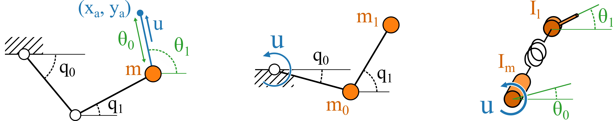

# Description

This directory is dedicated to Wolfram Mathematica files which show a number of important properties of the three considered mechanical systems. These are required to prove that partial decoupling of is possible, depending on system dynamics. Furthermore, this allows for the creation of a set of training data. 

The mathematica notebooks are calculations for a specific mechanical system, and are thus separated by type. These are the following:

1. **smdp:** single-mass double pendulum, the protagonist of this thesis.
2. **dmdp:** double-mass double pendulum, a standard double pendulum with point mass at the elbow and end-effector.
3. **sea:** series-elastic actuator, a simple robotic component. 

$~~~~~~~~~~~~~~$ 1. smdp  $~~~~~~~~~~~~~~~~~~~~~~~~~~~~~~~~~~~~~~~~$ 2. dmdp $~~~~~~~~~~~~~~~~~~~~~~~~~~~~~~~~~~~~~~$ 3. sea
## Code overview

### smdp
1. *find_eoms_smdp.nb* \
This file analytically derives the equations of motion of the single-mass double pendulum, both in "naive" coordinates as well as in the analytically derived decoupling coordinates. These coordinates are the length of the actuator tendon $(\theta_0)$, and its angle $(\theta_1)$. The resulting mass matrix and input matrix can be determined as follows:\
\
$ M(\theta) = J_h^{-T}(q) M(q) J_h^{-1}(q)$\
\
$ A(\theta) = J_h^{-T}(q) A(q)$\
\
Where $J_h$ is the Jacobian of $h(q)$.

2. *verify_y_iv.nb* \
This file calculates the first four derivatives of the normal form output of the single-mass double pendulum. These calculations are used to determine feedback linearizing coefficients of the non-collocated controller.

### dmdp
1. *find_eoms_dmdp.nb* \
Similarly to the case for the single-mass double pendulum, this notebook attempts to 

### sea
1. *find_eoms_sea.nb* \
The decoupling eoms for a series-elastic actuator follow naturally from the standard choice of coordinates, as is illustrated in this notebook. 