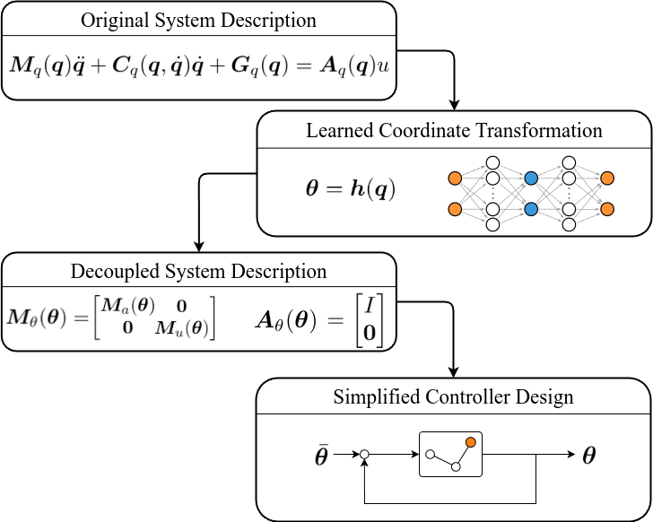

# Dynamic Decoupling for Control of Underactuated Robots

Underactuated robots are robots with fewer actuators than degrees of freedom (DOFs). 
This significantly complicates the control problem, because standard techniques (like computed torque control) cannot be used to override system dynamics. 
Instead, model-based controllers must somehow leverage the internal dynamics to achieve control goals. 
This has lead to 


## Description


For my thesis, I investigated how such internal dynamics could be better understood through a change of coordinates. In short, my thesis workflow is structured as follows (see Figure 1):

1. Identify underactuated system dynamics in original coordinates (Fig. 1, block 1)
2. Define desired dynamics in decoupling coordinates (Fig. 1, block 3)
3. Learn transform between original and decoupling coordiantes (using autoencoder) (Fig. 1, block 2)
4. Control system using decoupled description (Fig. 1, block 4)

For those less familiar with 

Robotic system coordinates are often chosen as the motor- and joint angles, which leads to an interpretable description. 
However, the dynamical matrices in Euler-Lagrange equations may be of complex form (see Figure 1). 
An appropriate choice of coordinates may be chosen, in which the inertia- and input matrix are decoupled. 
This decoupling can then be leveraged to write collocated- and non-collocated controllers. 


<p align="center">

</p>

This repository contains the code that I (KIan Heus) used and wrote during my thesis. 
During this thesis, I researched the possibility of using an Autoencoder machine learning framework to approximate decoupling coordinates for underactuated mechanical systems. 
Different directories with a short description are provided below. Directories marked as (WIP) are work-in-progress, with code and markdown changes planned to improve readability.


My **thesis report** can be downloaded [here](https://resolver.tudelft.nl/uuid:bcf08970-d7f2-495f-a100-2d3cfb48745b).

## [!] IMPORTANT NOTE 

During the preparation of my thesis defence, I have ravaged a number of Jupyter notebooks for data creation and visualization. After graduating, I have cleaned up the Mathematica files, but I do not intend to improve the main bulk of code. If you run into issues, or are interested in specific code snippets, feel free to raise an "Issue" on this page!


## Dependencies and installation

The machine learning aspect of this project, as well as many computations are built on the PyTorch framework. 

In order to run the presented Jupyter notebooks yourself, please follow the installation steps below. Instructions are provided for linux installation. For Windows/Mac analogs, please refer to git and anaconda installation guides online.

##

First, clone the repository to a desired location:

```
git clone https://github.com/kianheus/MSc_Thesis.git <directory-name>
```

Ensure that you have anaconda [installed](https://www.anaconda.com/docs/getting-started/anaconda/install). Then move to the repository location and create a new conda environment with required dependencies:
```
cd <directory-name>
conda env create -f environment.yml
```

To activate the conda environment, run:
```
conda activate thesis_kian
```

In order to interact with all parts of the code, you may run a Jupyter notebook:
```
jupyter notebook
```

Alternatively, you can run the notebooks in a code editor of your choice. Make sure that the proper kernel is selected.     

## Important directories
1. **Kian_code/Mathematica**. This directory contains analytic computations which support findings and proofs used in the thesis. (WIP)

2. Mechanical systems:\
    2.a. **Kian_code/Double_Pendulum**. This directory contains code for dynamics simulation and coordinate learning of the single-mass double pendulum system. (WIP)\
    2.b. **Kian_code/Series_Elastic_Actuator**. This directory contains similar code, for the series-elastic actuator system. (WIP)

3. **Kian_code/Controllers**. This directory contains multiple controllers with built-in simulation for the single-mass double pendulum, along with results. (WIP)

4. **Plotting**. This directory contains plotter files and simulation results. (WIP)


P.S. \
The code was originally forked from the assignment code for the Robotics course Intelligent Control Systems (ICS) of the TU Delft, but in the end I wrote my own simulations. 